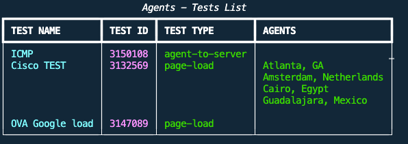
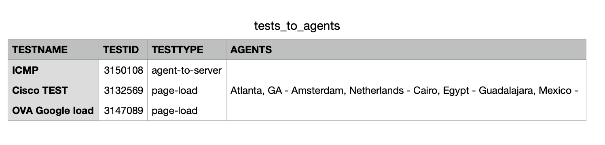

## Introduction
This script provides the name of the agent where the test is running.

## Requirements
The script uses the following modules, therefore it is required to have these installed beforehand.

- requests
- csv
- rich

## How to Use
The script requests the following information:

Email: 
Token: 

**Note**: The token is hidden, therefore you will not see anything when typing.

## Output
The script will produce an output like the one below:

In addition, the script will generate a CSV report named **tests_to_agents.csv** in the same directory where the script is hosted.

## BDB Version
This is script is also hosted in BDB, it can be executed online in this [link](https://scripts.cisco.com/ui/use/te_agent_test_list)

Regards
