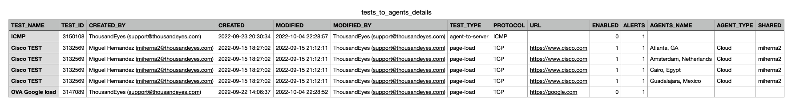

## Introduction
This script provides the name of the agent where the test is running, in addition it provides further details which can be observed in the **output** section in this document.

## Requirements
The script uses the following modules, therefore it is required to have these installed beforehand.

- requests
- csv

## How to Use
The script requests the following information:

Email: 
Token: 

**Note**: The token is hidden, therefore you will not see anything when typing.

## Output
The script will generate a CSV report named **tests_to_agents_details.csv** in the same directory where the script is hosted.

## BDB Version
If you prefer to conduct the test online without installing any library, you can execute this report using the [BDB Version - te_agent_test_details_list](https://scripts.cisco.com/ui/use/te_agent_test_details_list). This option is only available internally (Cisco's employees).

Regards
